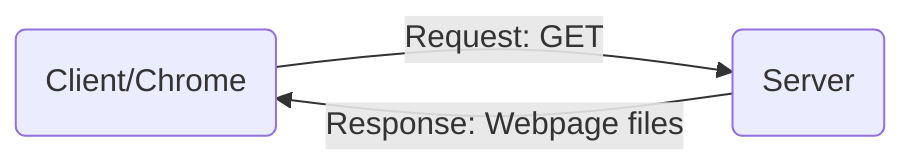

# [MIT Web Lab](https://weblab.mit.edu/schedule/)

A web development crash course in MIT.

# Lecture 1: Kickoff

**Accessing a Website**



**WebPage files**

- HTML: Building blocks

```html
<div class="text-box">
    <p>So text. Much HTML. Wow.</p>
</div>
```

- CSS: Makes it look pretty

```css
.text-box {
    front-family: "Comic Sans";
    color: pink;
    transform: rotate(20deg);
}

```

- JavaScript: Helps move things around.

```javascript
var doge = "moar text";
console.log(doge);
```

# Lecture 2: HTML/CSS

**Terminology**

- File: a file (basic unit of information storage)
- Directory: a folder, which can hold files and other directories
- Terminal: the command line window(often used as a synonym for cmd)

```shell
$ git remote add origin git@github.com:{username}/{repository}.git

$ git --set-upstream origin master
```

## Toolchains cheatsheet

[Cheatsheet](https://weblab.mit.edu/resources/)

