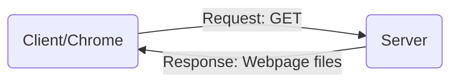
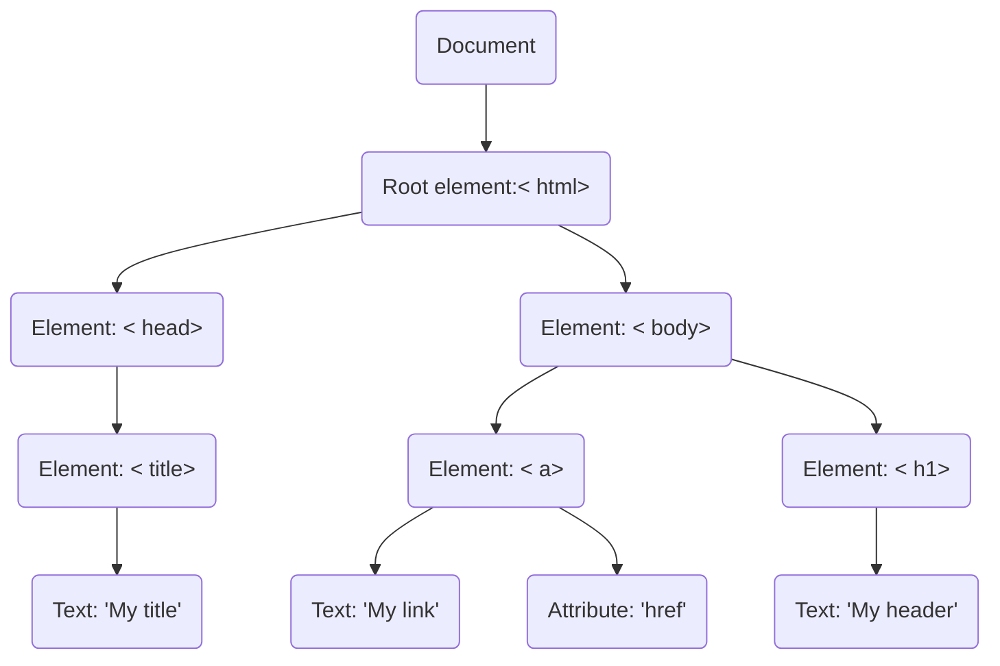

# Web 2

**Todo**

- HTML/CSS
- JavaScript/TypeScript
- MongoDB/Postgres
- Socket Programming

# Basic

**Accessing a Website**



**WebPage files**

- HTML: Building blocks

```html
<div class="text-box">
    <p>So text. Much HTML. Wow.</p>
</div>
```

- CSS: Makes it look pretty

```css
.text-box {
    front-family: "Comic Sans";
    color: pink;
    transform: rotate(20deg);
}

```

- JavaScript: Helps move things around.

```javascript
var doge = "moar text";
console.log(doge);
```

# HTML/CSS

## Toolchains cheatsheet

[Cheatsheet](https://weblab.mit.edu/resources/)

**Terminology**

- File: a file (basic unit of information storage)
- Directory: a folder, which can hold files and other directories
- Terminal: the command line window(often used as a synonym for cmd)

```shell
$ git remote add origin git@github.com:{username}/{repository}.git

$ git --set-upstream origin master
```

## HTML: Bones/structure

A.K.A.: Hypertext Markup Language

- The language your web browser uses to describe the content and structure of web pages.

- = Nested Boxes

**Syntax Parse**

- `<!DOCTYPE html>`: make sure page uses latest html and not some random fllback version.

- `<html></html>`: Root. An html element is marked by opening and closing tags. Not only show where your nested containers are, but also what content exist within that container. 

- In memory level, the structure of HTML is the "DOM(Document Object Model)".


**Basic HTML Tags**
1. `<html>`: Root of HTML Document.
2. `<head>`: Info about Document.
3. `<body>`: Document Body.
4. `<h1>, <h2>, <h3>`: Header tags.
5. `<p>`: Paragraph tag.
6. `<div>`: Generic block section tag.
7. `<span>`: Generic inline section tag.

**HTML Attributes**

- apply the attribute of anything under your element/tags. Modifies it.
- example of setting these HTML attributes is via links/images.
```html
<tagname attr="_">
    <a href="link here">Title</a>
     /* This is self-closing tag. */
</tagname>
```

## CSS: Skin/Styling

**Cascading Style Sheets**

The rules that tell your web browser how stuff looks.


